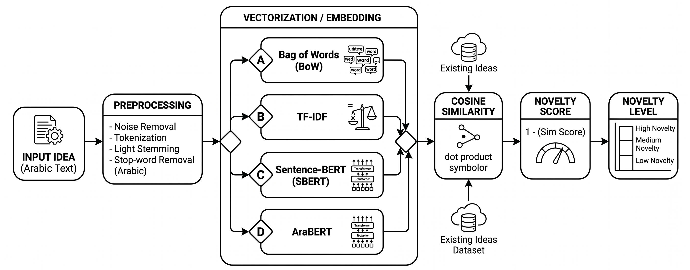
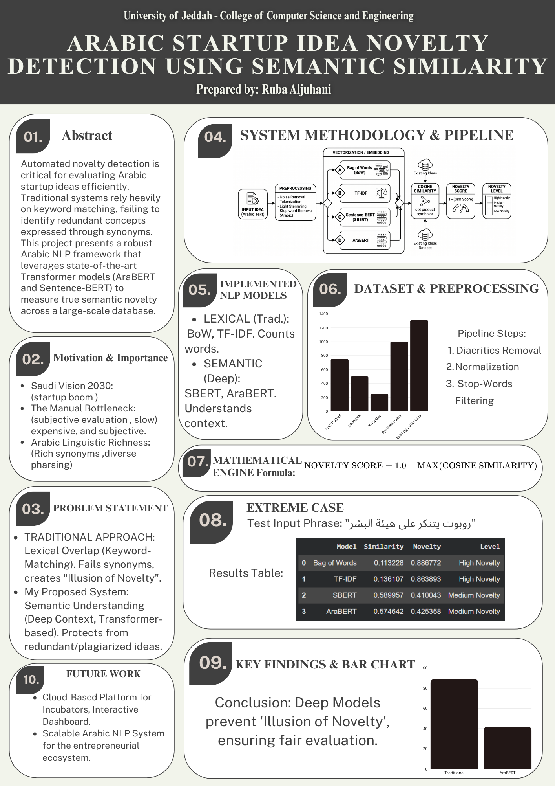

# Arabic Startup Idea Novelty Detection Using Semantic Similarity Techniques

An Arabic NLP system for measuring the novelty of startup ideas using semantic similarity techniques and transformer-based models.

---

# Overview

This project detects the novelty of Arabic startup ideas by comparing them with existing ideas using semantic similarity.

---

# Dataset

The dataset contains ~3756 Arabic startup ideas from:
- Hackathons  
- Competitions  
- Twitter/X  
- LinkedIn  
- Public sources  

---

# Models

- Bag of Words (BoW)
- TF-IDF
- Sentence-BERT (SBERT)
- AraBERT

---

# System Pipeline



---

# Project Files

## 📄 ACL Paper
👉 [View Paper](Arabic_Startup_Idea_Novelty_Detection_Using_Semantic_Similarity_Techniques.pdf)

## 📓 python Code 
👉 [Python](Arabic_Startup_Idea_Novelty_Detection_Using_Semantic_Similarity.ipynb)

## 📄 Project Poster Source:
👉 [View Scientific Poster](poster-nlp.png)

## 📊 Dataset
👉 [View Dataset](3750_hackathon_ideas.csv)

---

# How to Run

```bash
pip install -r requirements.txt
```

Then run the notebook:
```
notebooks/Arabic_Startup_Idea_Novelty_Detection_Using_Semantic_Similarity.ipynb
```

---

# Results

Transformer models (SBERT + AraBERT) performed better in semantic understanding than TF-IDF and BoW.

---
# Arabic Startup Idea Novelty Detection Using Semantic Similarity Techniques

An advanced Arabic Natural Language Processing (NLP) framework designed to automatically evaluate and measure the factual novelty of new startup proposals against a large-scale database of historical ideas, effectively eliminating the "illusion of novelty" caused by vocabulary variations and synonyms.

---

## Project Poster
Below is the official scientific poster summarizing the core pipeline, methodology, and benchmarking experiments conducted for this project:



---

## Overview
In entrepreneurial ecosystems like hackathons and incubation hubs, evaluating thousands of business abstracts manually is slow, expensive, and heavily subjective. Furthermore, Arabic is a morphologically rich language; two different founders can submit the exact same business concept using completely distinct phrasing or structural synonyms.

This project implements an end-to-end NLP framework that shifts the paradigm from simple literal keyword matching (**Lexical Overlap**) to deep contextual understanding (**Semantic Similarity**). By checking input ideas against a curated database of **3,756 records**, the engine maps the semantic boundaries to calculate a factual **Novelty Score**.

---

## Dataset & Preprocessing
The core benchmark relies on a highly curated collection of **3,756 Arabic startup descriptions** extracted and normalized from real-world entrepreneurial environments:
* **Primary Sources:** Local Saudi Hackathons, National Innovation Competitions, professional threads on X (Twitter), LinkedIn, and domain-targeted synthetic generation to ensure structural diversity.
* **Domain Clusters:** Artificial Intelligence, FinTech, HealthTech, CyberSecurity, AgriTech, and Smart Cities.

### Text Preprocessing Pipeline
To handle Arabic linguistic noise, an intensive cleansing script runs sequentially before vector generation:
1. **Diacritics Removal :** Stripping all short vowels and accents.
2. **Punctuation Cleaning:** Eliminating symbols, non-text components, and emojis.
3. **Character Normalization:** Standardizing variations of letters (e.g., mapping `أ`, `إ`, `آ` to a bare `ا`, and `ة` to `ه`).
4. **Arabic Stop-Words Filtering:** Dropping frequent uninformative words via custom token filters.

---

## Core System Architecture
The framework executes an automated textual comparison pipeline defined by four key phases:

1. **Input Generation:** Accepts raw Arabic paragraphs describing the candidate startup idea.
2. **Preprocessing:** Standardizes and cleans the text structure.
3. **Vector Vectorization (Embedding Extraction):** Converts tokens into dense contextual vectors using the target NLP model configuration.
4. **Mathematical Measurement Engine:** Computes the mathematical **Cosine Similarity** between the target vector $\vec{A}$ and every stored vector $\vec{B_i}$ within the historical repository database.

### Mathematical Formulation
The final novelty judgment is calculated as the exact logical inverse of the maximum semantic similarity found across the historical cluster:

$$\text{Novelty Score} = 1.0 - \max_{i} \left( \frac{\vec{A} \cdot \vec{B_i}}{\|\vec{A}\| \|\vec{B_i}\|} \right)$$

* **High Novelty ($\ge 0.70$):** Unprecedented concept contextually.
* **Medium Novelty ($0.40 - 0.69$):** Shares overlapping elements with prior systems but contains unique sub-domains.
* **Low Novelty ($< 0.40$):** Redundant concept with high risk of plagiarism/duplication.

---

## Evaluated Models
The study contrasts surface-level frequency counts against advanced Deep Learning Transformer-based architectures:

* **Bag of Words (BoW):** Maps literal word frequency dimensions; blind to syntax and semantic synonyms.
* **TF-IDF:** Evaluates token importance by computing Term Frequency against Inverse Document Frequency.
* **Sentence-BERT (SBERT):** Leverages twin Siamese networks to pull out semantic sentence embeddings optimized for cosine similarity structures.
* **AraBERT:** A state-of-the-art transformer architecture specifically pre-trained on massive Arabic web corpora, providing optimal contextual awareness of Arabic syntax.

---

## Qualitative Analysis & Extreme Testing
To evaluate model stability, a fictional, extreme "corner case" query was introduced to stress-test the system:
* **Test Input Phrase:** `"روبوت يتنكر على هيئة البشر"` *(A robot disguised as a human)*

### Benchmark Results

| Model Architecture | Lexical/Semantic | Cosine Similarity | Novelty Score | Final System Decision |
| :--- | :--- | :--- | :--- | :--- |
| **Bag of Words (BoW)** | Lexical Baseline | 0.1132 | **0.8867** | **High Novelty** (Fooled by phrasing) |
| **TF-IDF** | Lexical Baseline | 0.1361 | **0.8638** |  **High Novelty** (Fooled by phrasing) |
| **Sentence-BERT** | Semantic Deep Learning | 0.5899 | **0.4100** |  **Medium Novelty** (Accurate context) |
| **AraBERT** | Semantic Deep Learning | 0.5746 | **0.4253** |  **Medium Novelty** (Accurate context) |

### Core Empirical Finding
Traditional models fell directly into the **"illusion of novelty"**, marking the sci-fi concept as almost 90% unique because the specific words `"يتنكر"` (disguised) and `"البشر"` (human) are unique in standard business data.

Conversely, **AraBERT and SBERT** bypassed the literal characters, identifying the semantic core entity **"روبوت"** (Robot) and mapping it to the pre-existing robotics and artificial intelligence startups populated inside the 3,756 records database, producing an accurate **Medium Novelty** decision.

---
# Author

**Ruba Aljuhani**  
Email: Ruba35@gmail.com  

GitHub: https://github.com/ii3ruj
linkedin: https://www.linkedin.com/in/ruba-aljuhani-69052b2a4/
X: https://x.com/i3ruj
